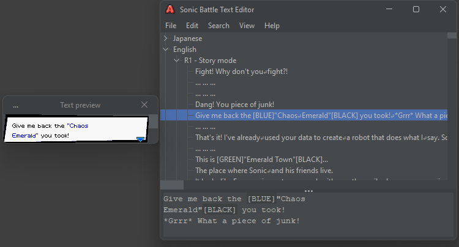

# Sonic Battle Text Editor

Sonic Battle Text Editor GUI

---

(how to build manually)

Open the source as a Maven project, then run:

`mvn clean compile assembly:single`

## Licensing

\#1 Sonic Battle Text Editor - https://github.com/sahlaysta/SonicBattleTextEditor - is licensed under [MIT license](https://github.com/sahlaysta/SonicBattleTextEditor/blob/master/LICENSE.txt)  
\#2 Jackson JSON - https://github.com/FasterXML/jackson - is licensed under [Apache License 2.0](https://github.com/FasterXML/jackson-core/blob/2.16/LICENSE)  
\#3 FlatLaf - https://www.formdev.com/flatlaf/ - is licensed under [Apache License 2.0](https://github.com/JFormDesigner/FlatLaf/blob/main/LICENSE)  
\#4 trove4j - https://bitbucket.org/trove4j/trove - is licensed under [GNU Lesser General Public License 2.1](https://bitbucket.org/trove4j/trove/src/master/LICENSE.txt)  
\#5 guava - https://github.com/google/guava - is licensed under [Apache License 2.0](https://github.com/google/guava/blob/master/LICENSE)  
\#6 sahlaysta.swing - https://github.com/sahlaysta/swing - is licensed under [MIT license](https://github.com/sahlaysta/swing/blob/main/LICENSE)
